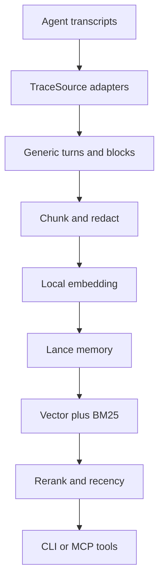

# Funes architecture and Windows-readiness analysis

Status: baseline analysis; implementation evidence is recorded in the change's execution.md
Repository snapshot: `huggingface/funes` `main@1a01cc243b06a2d70f08f0da338b9bf29c275631`
Related issue: [#136 — When to support Windows and desktop app for agents](https://github.com/huggingface/funes/issues/136)

## 1. Conclusion

Windows support is not only a matter of adapting the user-facing command line from Bash to CMD.
The public CLI is already mostly ordinary Rust and should work in both CMD and PowerShell once it
builds, but the product currently has five platform seams that block a native Windows release:

1. the default inference backend only defines macOS and Linux implementations;
2. hook installation and self-update import Unix-only filesystem APIs;
3. automatic indexing/publishing is implemented by Bash scripts and Unix detachment primitives;
4. home-directory, cache, known-session-root, and local-path detection assume POSIX conventions;
5. CI, release packaging, checksums, and installation publish only Linux and Apple Silicon macOS.

The smallest credible Windows release is therefore a native x86-64 CLI plus Codex integration,
not a desktop GUI and not full four-agent parity. It should be installable with PowerShell and then
usable from either PowerShell or CMD.

## 2. Product invariants

The Windows change must preserve the design constraints in `docs/RATIONALE.md`:

- memory remains an append-only event log;
- ingest remains deterministic (`parse -> chunk -> embed`) with no LLM;
- indexing, embedding, reranking, and local recall stay local-first;
- recall remains explicitly pulled by the user or agent;
- stored chunks retain exact session/turn provenance;
- the embedding model identity and memory compatibility contract do not change by OS.

Windows support is a platform port. It must not redesign the memory model or retrieval behavior.

## 3. Runtime architecture

| Layer | Current implementation | Contract |
| --- | --- | --- |
| CLI entry and dispatch | `src/main.rs` | `clap` commands route into command modules; human output and MCP output are separate contracts. |
| Agent integrations | `src/agents/{claude,codex,pi,hermes}.rs` | `funes add/remove` installs MCP/skills/hooks without overwriting unrelated user config. |
| Trace discovery | `src/traces/harness.rs`, `src/traces/source.rs` | Known agent roots or explicit paths become a `TraceSource`. |
| Parsing | `src/traces/*.rs` | Agent-specific records become generic turns and blocks with provenance. |
| Indexing | `src/commands/index.rs`, `src/chunk.rs` | Incremental, idempotent, tiered parse/chunk/embed/write pipeline. |
| Inference | `src/inference.rs`, `src/inference/blas.rs` | Pinned local embedder and reranker behind common traits. |
| Storage | `src/memory.rs`, `src/memory/*` | Local or Hub-backed Lance dataset; local memory is rebuildable from transcripts. |
| Retrieval | `src/commands/recall.rs` | Vector + BM25 fusion, cross-encoder rerank, recency weight, neighbor expansion. |
| Agent-facing API | `src/commands/mcp.rs` | Stdio MCP exposes recall/get/sessions/scan/sketch/status; stdout is reserved for JSON-RPC. |
| Automation | `src/agents/hooks.rs`, `scripts/automation/*.sh` | Per-turn indexing and session-boundary publishing detach from the agent hook. |
| Distribution | `.github/workflows/*.yml`, `scripts/install.sh`, `src/commands/update.rs` | Build, checksum, publish, install, and self-update platform assets. |

## 4. Existing behavior that is already close to Windows-ready

- CLI argument parsing, JSON/JSONL/SQLite/Parquet parsing, chunking, redaction, MCP stdio, and most
  retrieval logic use portable Rust APIs.
- `std::process::Command` can launch `codex.exe`, `claude.exe`, or other executables through Windows
  `PATH` without going through CMD.
- Existing Claude fixtures already contain Windows drive paths and PowerShell tool records, so part
  of the trace parser has incidental Windows coverage.
- Ratatui/crossterm and Tokio support Windows, subject to a native CI run.
- `FUNES_HOME`, `CODEX_HOME`, `PI_CODING_AGENT_DIR`, `FUNES_BIN`, and HF token environment
  overrides can remain platform-independent escape hatches.

## 5. Concrete blockers

| Severity | Blocker | Evidence | Minimum change |
| --- | --- | --- | --- |
| Compile blocker | `src/inference/blas.rs` defines a `seam` only for macOS and Linux. | `#[cfg(target_os = "macos")]` and `#[cfg(target_os = "linux")]` | Reuse the pure-Rust faer seam on Windows, or select the ONNX backend after a dependency spike. |
| Compile blocker | Unix-only `PermissionsExt` is imported by hooks and updater code/tests. | `src/agents/hooks.rs`, `src/commands/update.rs`, integration-test support | Gate executable-bit logic/tests with `cfg(unix)` and add Windows-specific behavior. |
| Runtime blocker | Automation invokes Bash and uses `nohup`, `/dev/null`, and `disown`. | `scripts/automation/funes-index.sh`, `funes-push.sh`, `hooks::command`, pi extension | Add Windows PowerShell hook scripts and a platform-specific command builder. |
| Runtime blocker | Home and HF-cache discovery directly read `HOME`. | agent integrations, `traces/harness.rs`, `memory/dataset.rs`, `hub.rs`, `inference/blas.rs` | Centralize profile/home/cache resolution and preserve env overrides. |
| Correctness blocker | Harness detection string-matches `".codex/sessions"`; Windows canonical paths use `\\`. | `Harness::from_known_dir` | Compare `Path` components rather than rendered strings. |
| Correctness blocker | `<org>/<repo>` shorthand detection can confuse Windows paths containing `/`. | `hub::is_remote_shorthand`, `Memory::parse` | Recognize drive-rooted and UNC paths before remote shorthand. |
| Update blocker | Self-update relies on renaming over the currently running Unix executable. | `src/commands/update.rs` | For the minimum release, provide actionable re-install guidance; implement deferred self-replacement later. |
| Delivery blocker | No Windows CI job, asset, checksum entry, or installer exists. | CI/release workflows and README platform table | Add `windows-latest`, an MSVC x64 asset, `install.ps1`, installer tests, and release manifest wiring. |
| Dependency risk | Native Windows compatibility of the exact Lance/faer/multiversion dependency graph is not proven in this repo. | Linux-only CI | Make a Windows dependency build spike the first implementation gate. |

## 6. Minimum support boundary

### Included

- Native Windows 10/11 x86-64 (`x86_64-pc-windows-msvc`), without WSL.
- Install with Windows PowerShell 5.1+; run `funes.exe` from PowerShell or CMD.
- Core commands: `index`, `recall`, `get`, `sessions`, `sketch`, `scan`, `status`, `scrub`, `push`,
  `ask codex`, and `mcp`.
- Local and Hub-backed memory flows, with the external trufflehog prerequisite documented for push.
- `funes add codex` / `funes remove codex`, including the skill, MCP registration, per-turn index,
  and bound-memory session publication.
- Windows-aware home/cache/session paths, drive paths, UNC paths, spaces, and non-ASCII paths.
- Windows CI, installer verification, release asset, checksum, and documentation.
- A deterministic message for unsupported Windows integrations or self-update paths; no partial
  configuration writes.

### Excluded from this change

- Desktop GUI, tray app, service, or background daemon.
- Windows ARM64-native release.
- Full native Windows support for Claude, pi, and Hermes integrations; their trace files may still
  be indexed explicitly.
- Winget, Chocolatey, Scoop, MSI, or Microsoft Store distribution.
- Redesigning storage, retrieval ranking, chunk schema, or model selection.
- Replacing Unix automation scripts with a new cross-platform daemon.
- In-place `funes update` on Windows; re-running `install.ps1` is the minimum update path.

## 7. Recommended sequencing

1. Prove the exact dependency graph on `windows-latest` before changing product behavior.
2. Make the Rust core compile by adding the inference and Unix-API platform seams.
3. Centralize path/profile handling and add Windows-path tests.
4. Validate explicit-path indexing and local recall end to end.
5. Port only the Codex automation path to PowerShell.
6. Add installer/release packaging and then make Windows CI required.
7. Document explicit limitations and open separate changes for self-update, additional agents, and GUI.

## 8. Research basis

- [Funes README](https://github.com/huggingface/funes/blob/1a01cc243b06a2d70f08f0da338b9bf29c275631/README.md)
- [Design rationale](https://github.com/huggingface/funes/blob/1a01cc243b06a2d70f08f0da338b9bf29c275631/docs/RATIONALE.md)
- [Indexing pipeline](https://github.com/huggingface/funes/blob/1a01cc243b06a2d70f08f0da338b9bf29c275631/docs/index.md)
- [Agent automation](https://github.com/huggingface/funes/blob/1a01cc243b06a2d70f08f0da338b9bf29c275631/docs/automation.md)
- [Agent hook implementation](https://github.com/huggingface/funes/blob/1a01cc243b06a2d70f08f0da338b9bf29c275631/src/agents/hooks.rs)
- [Inference platform seam](https://github.com/huggingface/funes/blob/1a01cc243b06a2d70f08f0da338b9bf29c275631/src/inference/blas.rs)
- [Trace-root discovery](https://github.com/huggingface/funes/blob/1a01cc243b06a2d70f08f0da338b9bf29c275631/src/traces/harness.rs)
- [Release workflow](https://github.com/huggingface/funes/blob/1a01cc243b06a2d70f08f0da338b9bf29c275631/.github/workflows/release.yml)
